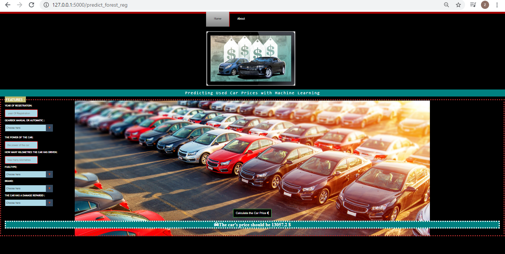

# Machine-Learning-Project
<h1><mark>Predicting Used Cars Prices with Machine Learning and development web application with Flask for the deployment of the model </mark></h1>
<h3>-Elaboration of a Multiple Regression Model in order to predict the price according to several variables</h3>
<h3>-Elaboration of the different Classification and clustering models in order to predict the type of cars (Automatic / Manual)</h3>

<h2>in the notebook file  <h1><u> <a href="https://nbviewer.jupyter.org/github/zackhr/Machine-Learning-Project/blob/master/Cars_project.ipynb" >cars_project</a></u></h1> you will find the different steps to realize the project: </h2>
<ul>
  <li>Exploration and visualisation of data </li>
  <li>Cleaning dataset and missing values </li>
 <li> Machine Learning Models and Evaluation</li>
  <li>Saving and Using the model</li>
  <li>Deployment of the model </li>
  </ul>
  
  
<h3>I have worked on a dataset of used cars listed from Ebay Kleinanzeigen Germany .</h3>
<h3>the data was extracted from a form filled by people who want to sell cars on the ebay site</h3>
